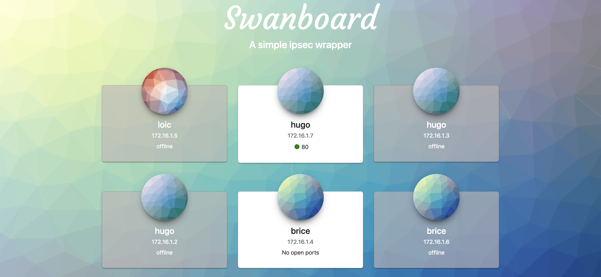

Swanboard
=========

### This project is no longer maintained and it presents major risks for the security since the dependencies have not been updated

A simple dashboard wrapping `ipsec` command provided by StrongSwan.





## Dependencies

The dependencies are provided in the `vendor/` folder

## Regenerate frontend files

You'll need npm and NodeJS in order to change the frontend located in /web 

```bash
cd web
npm install
npm run build
cd ..
rice embed-go -i github.com/maxenceadnot/swanboard/cmd/swanboard
```

## Compile

Compile with :
`CGO_ENABLED="0" go build github.com/maxenceadnot/swanboard/cmd/swanboard`

## Installation on a systemd operating system

Transfer the binary built with `scp` and move it to `/usr/local/bin` and `chmod +x` the file

Transfer `init/swanboard.service` to `/etc/systemd/sytem` and type:
```
sudo systemctl daemon-reload
sudo systemctl enable swanboard.service
sudo systemctl start swanboard.service
```

## License

This project is licensed under the MIT License. Please read the [LICENSE file](LICENCE).
